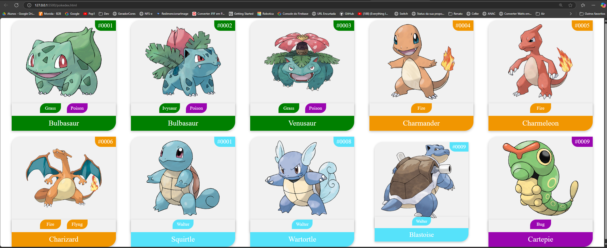

### Tecnologias
* > HTML
* > CSS

### Telas feitas




### Referencias pokemon

* > Paleta de cores
```
https://paletadecores.com/
```

* > Fonte pokemon
```
https://www.pokemon.com/br/pokedex
```

* > Sombras
```
https://getcssscan.com/css-box-shadow-examples
```
